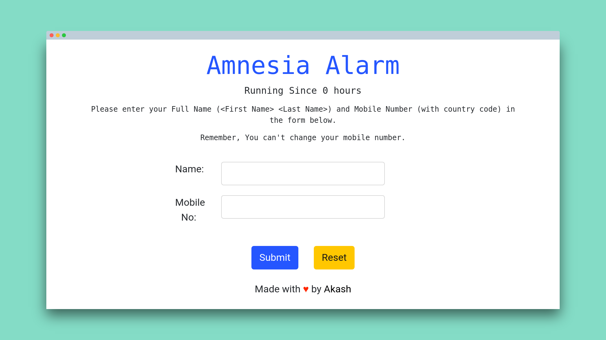

# amnesia-alarm

    An SMS based alarm for people who forget their name every hour, to remind them who they are. This app was a screening-task but became a side project at a later stage.

This is a very fundamental Node/Express app and you will be able to understand easily.

I have used firebase to store user data and twilio to send sms to the users. This twilio part may/may-not work. But other things are working fine. There are still some ~~major~~ bugs in the app, hope you find em (and collect a bounty). I am aware of those bugs but I don't have enought time right now to fix those, if your are interested, you can work on em.



## file structure

- app.js - main server file
- public/ - html client

## contribute

- clone this repo using ```git clone https://github.com/skywalker212/amnesia-alarm.git```
- ```cd amnesia-alarm```
- run ```npm install``` or ```yarn install``` to install the modules
- run ```npm start``` to start the application locally
- find bugs/ improve functionality
- report it in issues
- raise a PR